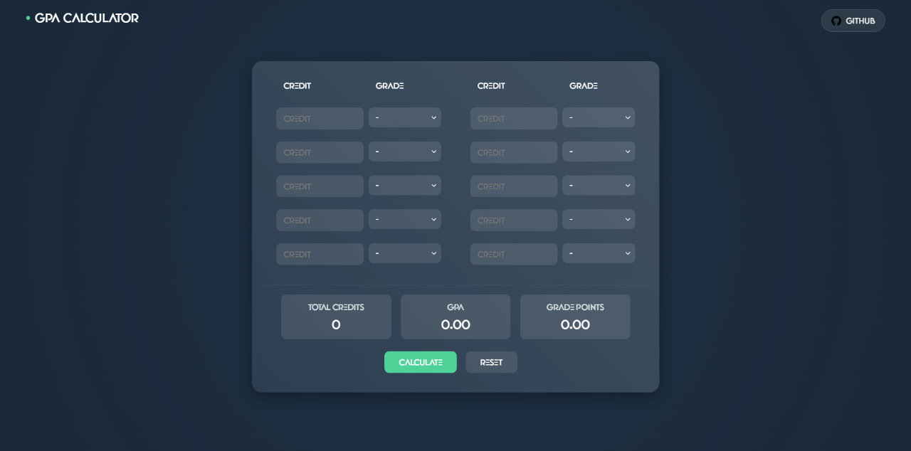

# 🧮 GPA Calculator

## Description

This is a simple GPA calculator that allows you to calculate your GPA based on the credits and grades of your courses. A sleek, modern GPA calculator with a responsive design and interactive UI elements.

## Features

- 🎨 Modern UI with glassmorphism design
- 🖱️ Custom cursor and hover effects
- 📱 Fully responsive layout
- ✨ Smooth animations and transitions
- 🧮 Real-time GPA calculation
- 🔄 Reset functionality
- ⚡ Input validation

## How to Use

1. Enter Credits (1-5) for each course
2. Select the corresponding grade (A+ to F)
3. Click "Calculate" to see:
   - Total Credits
   - GPA
   - Grade Points
4. Use "Reset" to clear all inputs

## Grade Conversion Table (UM)

| Letter | Marks   | Grade Point |
|--------|---------|-------------|
| A+     | 90-100  | 4.0        |
| A      | 80-89   | 4.0        |
| A-     | 75-79   | 3.7        |
| B+     | 70-74   | 3.3        |
| B      | 65-69   | 3.0        |
| B-     | 60-64   | 2.7        |
| C+     | 55-59   | 2.3        |
| C      | 50-54   | 2.0        |
| C-     | 45-49   | 1.7        |
| D+     | 40-44   | 1.3        |
| D      | 35-39   | 1.0        |
| F      | 0-34    | 0.0        |

## Source

Grade conversion table based on Universiti Malaya (UM) grading scheme.

## License

This project is licensed under the MIT License. See the [LICENSE](LICENSE) file for details.